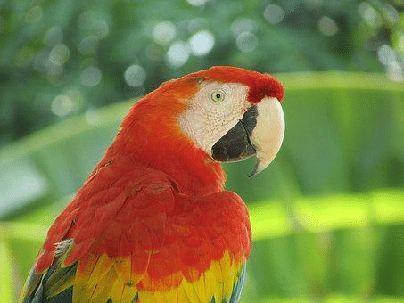

# Real-ESRGAN
PyTorch implementation of a Real-ESRGAN model trained on custom dataset. This model shows better results on faces compared to the original version. It is also easier to integrate this model into your projects.

> This is not an official implementation. We partially use code from the [original repository](https://github.com/xinntao/Real-ESRGAN)

Real-ESRGAN is an upgraded [ESRGAN](https://arxiv.org/abs/1809.00219) trained with pure synthetic data is capable of enhancing details while removing annoying artifacts for common real-world images. 

You can try it in [google colab](https://colab.research.google.com/drive/1YlWt--P9w25JUs8bHBOuf8GcMkx-hocP?usp=sharing) [](https://colab.research.google.com/drive/1YlWt--P9w25JUs8bHBOuf8GcMkx-hocP?usp=sharing)

- [Paper (Real-ESRGAN: Training Real-World Blind Super-Resolution with Pure Synthetic Data)](https://arxiv.org/abs/2107.10833)
- [Original implementation](https://github.com/xinntao/Real-ESRGAN)
- [Huggingface 🤗](https://huggingface.co/sberbank-ai/Real-ESRGAN)

### Installation

```bash
pip install git+https://github.com/sberbank-ai/Real-ESRGAN.git
```

### Usage

GUI Usage:

```python
streamlit run run.py
```

Or simply double click on run.bat

---
Basic usage:

```python
import torch
from PIL import Image
import numpy as np
from RealESRGAN import RealESRGAN

device = torch.device('cuda' if torch.cuda.is_available() else 'cpu')

model = RealESRGAN(device, scale=4)
model.load_weights('weights/RealESRGAN_x4.pth', download=True)

path_to_image = 'inputs/lr_image.png'
image = Image.open(path_to_image).convert('RGB')

sr_image = model.predict(image)

sr_image.save('results/sr_image.png')
```


### Examples

---

Low quality image:


Real-ESRGAN result:


---

Low quality image:



Real-ESRGAN result:


---

Low quality image:


Real-ESRGAN result:


